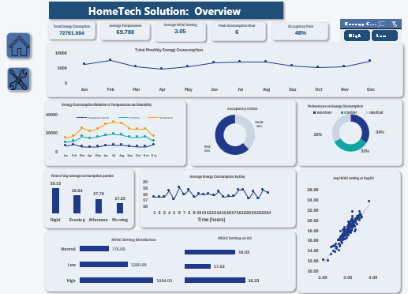

  

### <a href="https://hometech-energy.streamlit.app/" target="_blank">Access the Hometech app</a>

# HomeTech SmartSense: Energy Optimization Dashboard

##  Project Overview
This project addresses the challenge of inefficient energy usage in rental properties managed by **HomeTech Solutions**. By leveraging IoT sensor data (temperature, occupancy, HVAC settings), this dashboard provides property managers with real-time insights to reduce operational costs, enhance tenant comfort, and promote sustainability.

---

##  Key Objectives
* **Real-time Monitoring:** Track energy consumption (kWh) and HVAC patterns across multiple units.
* **Inefficiency Detection:** Identify units with high waste relative to occupancy and tenant behavior.
* **Predictive Maintenance:** Correlate maintenance logs with sensor anomalies to prevent system failures.
* **Tenant Insights:** Analyze how energy preferences (Cooler/Warmer) impact the bottom line.

---

##  Technology Stack
* **Data Processing:** Microsoft Excel (Power Query, Z-Score Outlier Detection).
* **Analysis:** Pivot Tables, Advanced Formulas, Statistical Modeling.
* **Visualization:** Interactive Excel Dashboard with Slicers, KPI Cards, and Trend Analysis.

**Core Formula for Outlier Detection:**
$$Z = \frac{x - \mu}{\sigma}$$

---

## Dataset Architecture
The analysis is driven by two primary datasets:
1.  **Sensor Data:** 11 features including Timestamp, Occupancy, HVAC Setting (0-5), and Energy Consumption.
2.  **Maintenance Logs:** Historical records of system failures and resolutions (e.g., thermostat recalibration).

---

## Data Transformation Workflow
To ensure data integrity, the following steps were implemented:

1.  **Outlier Removal:** Applied Z-score filtering to remove sensor noise and erroneous energy spikes.
2.  **Missing Value Imputation:** Handled null energy values using `AVERAGEIF` based on specific Unit ID means.
3.  **Feature Engineering:**
    * **HVAC Classification:** Categorized settings into *Low, Medium, and High*.
    * **Time-of-Day Derivation:** Segmented timestamps into *Morning, Afternoon, Evening, and Night*.
    * **High-Usage Flags:** Automated alerts for units exceeding average consumption thresholds.

---

## Key Insights & Dashboard Features
* **Occupancy vs. Energy:** Identifying "ghost usage" where energy is high in unoccupied units.
* **Seasonal Trends:** Visualizing HVAC demand fluctuations to forecast utility costs.
* **Maintenance Correlation:** Tracking how frequent malfunctions (e.g., HVAC failure) impact efficiency.

---

## Impact & Results
* **Cost Efficiency:** Identified potential 15-20% reduction in waste via optimized HVAC scheduling.
* **Proactive Care:** Maintenance alerts reduced emergency repair costs by flagging inefficient units early.
* **Sustainability:** Provided data-backed recommendations for eco-friendly tenant behavior.

---

## 👤 Author
**[Edwina Abam]**
* **Role:** Data Analyst 
* **Tools:** Excel 